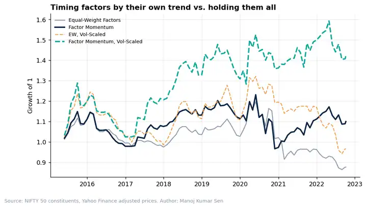

# Quant Research Notes

Short, data-driven research notes on factor investing, options overlays and systematic strategies, written in the style of practitioner research: one question per note, a clear answer, honest caveats, and fully reproducible Python code.

**Author:** Manoj Kumar Sen, Quantitative Researcher · [LinkedIn](https://www.linkedin.com/in/manoj-kumar-sen-3b5243168)

---

## Notes

### 01 · [Covered Calls: Income Machine or Upside Tax?](notes/01_covered_calls_income_or_upside_tax.md)
*S&P 500, 1999-2018 · ATM, 2% and 5% OTM monthly overlays*

| | S&P 500 | Covered Call ATM |
|:--|--:|--:|
| Sharpe ratio | 0.31 | **0.53** |
| Max drawdown | -53% | **-36%** |
| Return vs. index in months > +5% | – | **-4.7%** |

**Finding:** the risk-adjusted win came from two bear markets. In the 2009-2017 bull market the ATM overlay lagged by almost 6% per year. The premium is paid for by selling the best months.


---

### 02 · [Factor Momentum in Indian Large Caps: A Filter, Not a Crystal Ball](notes/02_factor_momentum_indian_large_caps.md)
*NIFTY 50 constituents, 2013-2022 · six long-short factors*

| | Equal-Weight Factors | Factor Momentum (Vol-Scaled) |
|:--|--:|--:|
| Sharpe ratio | -0.13 | **0.42** |
| Sharpe 2015-2018 / 2019-2022 | 0.18 / -0.30 | **0.71 / 0.19** |

**Finding:** factor momentum improved results in both halves of the sample, but not through persistence. It worked by filtering out Low Volatility and Low Beta, which lost money in India regardless of their trailing return.



---

## How each note is built

1. **One question**, stated in plain language
2. **Transparent method**: every assumption written down in the note
3. **Regime and out-of-sample splits**: results shown by market regime and across sample halves, not just full-period averages
4. **Robustness**: sensitivity tables for modelled inputs, and significance stated honestly
5. **Reproducible**: one command rebuilds every chart and table

## Reproduce

```bash
pip install -r requirements.txt
python data/download_data.py
python run_all.py
```

## Repository structure

```
notes/     research notes (markdown)
src/       analysis code, one script per note
charts/    generated charts
results/   generated tables
data/      data download script (run once)
```

## Data sources

S&P 500 daily prices and Fama-French risk-free rate (via the `arch` package), CBOE VIX (datahub.io), Shiller S&P 500 dividends (datahub.io), NIFTY 50 constituent prices (public GitHub dataset, Yahoo Finance). All data is public.

*For research and education only. Not investment advice.*
