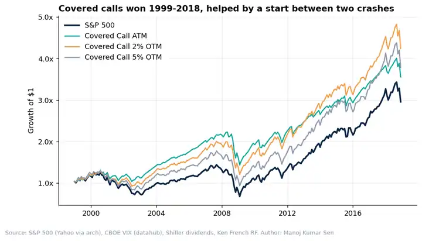
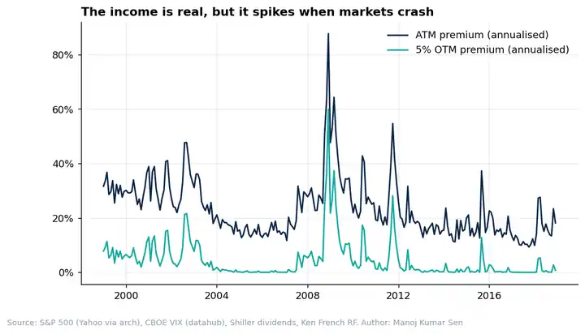
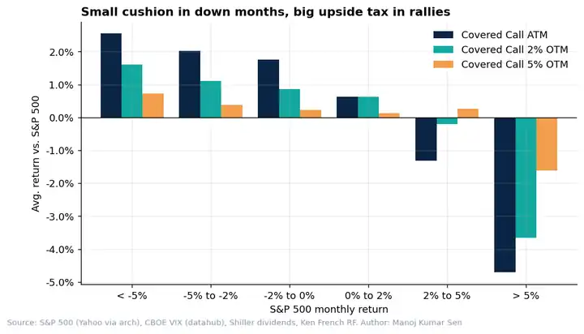
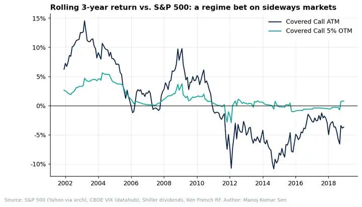

# Covered Calls: Income Machine or Upside Tax?

**Research Note 01** · September 2026 · Reading Time: 8 Minutes · Author: Manoj Kumar Sen

---

## SUMMARY

- A monthly covered call on the S&P 500 beat the index on a risk-adjusted basis from 1999 to 2018 (Sharpe 0.53 vs. 0.31)
- But the edge came almost entirely from two bear markets; in the 2009-2017 bull market the ATM overlay gave up almost 6% per year
- The premium is not free income: investors are selling their best months, and the cost shows up exactly when markets rally hardest

---

## INTRODUCTION

Income products are having a moment. Covered call ETFs have become some of the fastest-growing funds in the US, and in India the same idea is sold to retail traders as "rent from your portfolio": hold the stock, sell an out-of-the-money call every month, collect the premium.

I trade index options on the NSE and teach this exact strategy to students, and the question I get most often is simple: *is the premium real money, or am I just giving away the upside?*

The honest answer is both. In this research note we deconstruct a systematic covered call on the S&P 500 over 20 years, split the result by market regime, and measure precisely how much upside is traded away for the income.

---

## METHODOLOGY IN BRIEF

We buy the S&P 500 and, on the first trading day of each month, sell a one-month call. The call is held to the next roll date and settled at intrinsic value. We test three strikes: at-the-money (ATM), 2% out-of-the-money, and 5% out-of-the-money.

We do not have historical option quotes, so each option is priced with Black-Scholes using the VIX as the implied volatility proxy, less a haircut for skew (2 vol points for ATM, plus 0.7 vol points per 1% OTM). Dividends are added to both the index and the overlay, and 5% of every premium is deducted as trading cost. The sensitivity to these assumptions is shown at the end of the note.

---

## A 20-YEAR WIN, WITH AN ASTERISK

Over the full period, all three covered call variants beat the S&P 500. The ATM overlay delivered 6.6% per year against 5.6% for the index, with volatility of 9.6% instead of 16.0%, and a maximum drawdown of -36% instead of -53%.

That sounds like a free lunch, but the starting point matters. January 1999 sits just before the dot-com bust, and the sample includes the Global Financial Crisis. A strategy that sells upside and keeps the premium will always look good in a period with two major crashes.

| | S&P 500 | CC ATM | CC 2% OTM | CC 5% OTM |
|:--|--:|--:|--:|--:|
| Annual return | 5.6% | 6.6% | 7.5% | 6.9% |
| Volatility | 16.0% | 9.6% | 11.9% | 14.2% |
| Sharpe ratio | 0.31 | 0.53 | 0.52 | 0.42 |
| Max drawdown | -53% | -36% | -40% | -47% |
| Upside capture | 100% | 61% | 83% | 96% |
| Downside capture | 100% | 46% | 70% | 89% |

---

## THE INCOME IS REAL, BUT IT IS CYCLICAL

The ATM call earned an average premium of 2.0% per month, or roughly 23% annualised. That number is attractive, but it is not stable: premiums are highest when the VIX spikes, which is precisely when the index is falling. The single richest month was December 2008, when the ATM call paid 7.3% of the index value.

The implication for investors is that covered call "yield" is a function of fear. When markets are calm, the income shrinks; when markets panic, the income is large but the stock position is losing far more.

---

## THE UPSIDE TAX

The chart below shows the average monthly return of each overlay relative to the S&P 500, grouped by how the index performed that month.

In months when the index fell more than 5%, the ATM covered call outperformed by about 2.5%. In months when the index rallied more than 5%, it underperformed by 4.7%. There were 27 such rally months in the sample, and the ATM overlay gave up most of that upside.

This is the core trade-off: a covered call converts a portion of the right tail into a small, steady cushion. Further out-of-the-money strikes reduce the tax, but they also reduce the cushion.

---

## A REGIME BET ON SIDEWAYS MARKETS

Splitting the sample by regime makes the pattern clearer. The ATM overlay protected investors in the dot-com bust (-0.8% vs. -13.3% per year) and in 2008 (-20.8% vs. -34.0%), but lagged badly during the QE bull market of 2009-2017 (9.1% vs. 14.9% per year).

| Regime | S&P 500 | CC ATM | CC 2% OTM | CC 5% OTM |
|:--|--:|--:|--:|--:|
| Dot-com bust (2000-02) | -13.3% | -0.8% | -5.4% | -10.0% |
| Bull market (2003-07) | 11.7% | 13.5% | 13.9% | 13.0% |
| GFC (2008) | -34.0% | -20.8% | -24.3% | -29.9% |
| QE bull market (2009-17) | 14.9% | 9.1% | 12.9% | 14.3% |
| Vol shocks (2018) | -5.2% | -6.2% | -4.2% | -4.0% |

2018 is instructive: the ATM overlay capped the January rally and then fell with the market in February and December, delivering a worse result than the index. Covered calls do not protect against sharp drops; they only soften them by the size of the premium.

---

## HOW ROBUST IS THIS? (SENSITIVITY)

Because option prices are modelled rather than observed, we vary the two key assumptions. The ATM Sharpe ratio ranges from 0.53 to 0.80 depending on how much the VIX overstates the traded implied volatility. The direction of the result does not change, but the magnitude does, and the conservative end of the range is the one to trust. Real-world covered call indices also face execution frictions this model does not capture, so these results should be read as an upper bound.

| Skew (vol pts per 1% OTM) | ATM haircut vs. VIX | Sharpe S&P | Sharpe ATM | Sharpe 5% OTM |
|--:|--:|--:|--:|--:|
| 0.4 | 0.0 | 0.31 | 0.80 | 0.58 |
| 0.7 | 1.0 | 0.31 | 0.66 | 0.46 |
| 0.7 | 2.0 | 0.31 | 0.53 | 0.42 |
| 1.0 | 2.0 | 0.31 | 0.53 | 0.37 |

---

## FURTHER THOUGHTS

Covered calls are not an income product; they are a volatility-selling product with an equity position attached. The premium compensates investors for giving up the months that drive long-term equity returns, and whether that trade works depends almost entirely on the path of the market.

For investors comparing covered call ETFs, the useful questions are not about the headline yield but about the strike rule, the upside capture in strong months, and the regime the fund was launched into. A fund that launched after a crash will look very different from one launched at the top.

A natural extension, and the subject of a future note, is to run the same analysis on NIFTY options, where weekly expiries and high retail participation create a very different volatility risk premium.

---

*Code and data: [`src/covered_calls.py`](../src/covered_calls.py). Reproduce with `python src/covered_calls.py`. This note is for research purposes only and is not investment advice.*
