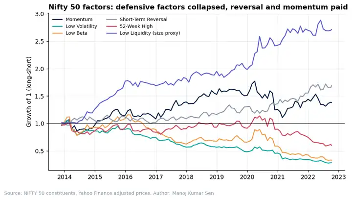
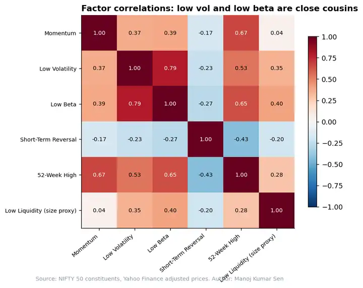
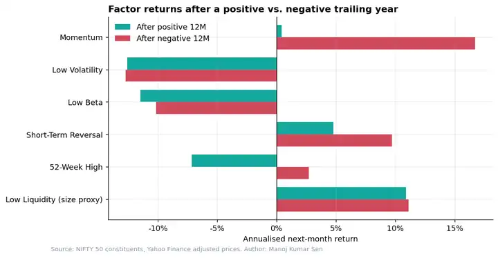

# Factor Momentum in Indian Large Caps: A Filter, Not a Crystal Ball

**Research Note 02** · September 2026 · Reading Time: 8 Minutes · Author: Manoj Kumar Sen

---

## SUMMARY

- Recent academic work shows that factors themselves trend: factors that did well over the past year tend to keep doing well
- Applied to six long-short factors in the NIFTY 50, factor momentum lifted the Sharpe ratio from -0.13 to 0.17, and to 0.42 with volatility scaling, in both halves of the sample
- However, the improvement came from switching off two chronically losing defensive factors, not from the classic "winners keep winning" effect

---

## INTRODUCTION

Factor investing has a timing problem. Every factor goes through long, painful drawdowns, and investors who hold them all equally have to sit through each one. Factor momentum offers a simple fix: hold a factor only when its own trailing return is positive. Ehsani and Linnainmaa (2022) showed this works across US and global factors, and Dickerson et al. (2025) extended the evidence.

Almost all of this research uses US data. Indian equities have a very different structure: a narrow large-cap market, heavy retail participation and strong sector rotation. I have built several hundred factor-based alphas on WorldQuant BRAIN, including in the India region, and wanted to test whether the result survives outside the US.

---

## METHODOLOGY IN BRIEF

The universe is the 50 current constituents of the NIFTY 50, with daily prices from October 2012 to October 2022. Every month we form six long-short factors, each going long the top third and short the bottom third of stocks, equally weighted:

- **Momentum**: 12-month return, skipping the latest month
- **Low Volatility**: low minus high 60-day volatility
- **Low Beta**: low minus high 1-year beta to the equal-weighted universe
- **Short-Term Reversal**: last month's losers minus winners
- **52-Week High**: stocks closest to their 52-week high minus furthest (George and Hwang, 2004)
- **Low Liquidity**: low minus high traded value, used as a size proxy since market caps are not in the dataset

The factor momentum strategy holds, each month, only the factors with a positive trailing 12-month return, equally weighted. No transaction costs are applied.

---

## THE FACTORS: DEFENSIVE STYLES COLLAPSED

The factor results in Indian large caps look very different from the US textbook. Low Volatility and Low Beta lost 13% and 10% per year respectively, with drawdowns above 70%. Short-Term Reversal and Momentum were positive, while Low Liquidity posted a Sharpe ratio above 1.0.

That last number should be read with great scepticism. Using today's index members introduces survivorship bias: stocks that were small and illiquid in 2012 and are in the NIFTY 50 today are, by construction, the ones that became big winners. The same bias likely hurts Low Volatility, since the high-volatility names in the universe are also the ones that survived and grew.

| Factor | Ann. Return | Volatility | Sharpe | Max Drawdown | Hit Rate |
|:--|--:|--:|--:|--:|--:|
| Momentum | 5% | 18% | 0.29 | -37% | 58% |
| Low Volatility | -13% | 15% | -0.87 | -74% | 44% |
| Low Beta | -10% | 21% | -0.48 | -72% | 43% |
| Short-Term Reversal | 7% | 12% | 0.54 | -13% | 53% |
| 52-Week High | -4% | 17% | -0.25 | -48% | 48% |
| Low Liquidity (size proxy) | 12% | 11% | 1.06 | -8% | 60% |

The correlations explain why a multi-factor portfolio did not diversify much here. Low Volatility and Low Beta had a correlation of 0.79, and both were positively correlated with the 52-Week High factor. Short-Term Reversal was the only factor negatively correlated with all others.

---

## DOES FACTOR MOMENTUM WORK?

At the portfolio level, yes. The equal-weighted combination of all six factors lost 1% per year with a Sharpe ratio of -0.13. Holding only the factors with positive trailing returns turned this into a gain of 2% per year and a Sharpe ratio of 0.17. Adding volatility scaling, which targets 10% annual volatility using the past six months, lifted it to 6% per year and a Sharpe ratio of 0.42. This mirrors US findings, where volatility scaling also improves factor momentum.

| Strategy | Ann. Return | Volatility | Sharpe | Max Drawdown |
|:--|--:|--:|--:|--:|
| Equal-Weight Factors | -1% | 10% | -0.13 | -28% |
| Factor Momentum | 2% | 11% | 0.17 | -22% |
| Equal-Weight, Vol-Scaled | 0% | 11% | 0.01 | -29% |
| Factor Momentum, Vol-Scaled | 6% | 13% | 0.42 | -20% |

---

## BUT NOT FOR THE REASON WE EXPECTED

The theory behind factor momentum is persistence: a factor that did well last year should do better next month. We tested this directly by splitting each factor's returns by whether its trailing year was positive or negative.

The persistence effect is largely absent. Momentum itself earned 16.7% annualised after a negative year and only 0.4% after a positive one. Low Volatility and Low Beta lost roughly the same amount regardless of their trailing return.

So where did the improvement come from? Low Volatility and Low Beta spent most of the sample with negative trailing returns, so the strategy mostly excluded them. Factor momentum worked as a filter that removed persistent losers, rather than as a signal that predicted which factor would win next month. On average the strategy held 3.3 of the 6 factors.

This is an important distinction for anyone implementing it: a filter only adds value if some factors are structurally broken in a given market. If all factors are healthy, the filter has little to remove.

---

## ROBUSTNESS: SPLITTING THE SAMPLE

To check that the result is not driven by a single period, we split the sample in two without changing any parameter. Factor momentum beat the equal-weighted portfolio in both halves, although the edge was much smaller after 2019.

| Strategy | Sharpe 2015-2018 | Sharpe 2019-2022 |
|:--|--:|--:|
| Equal-Weight Factors | 0.18 | -0.30 |
| Factor Momentum | 0.48 | 0.01 |
| Equal-Weight, Vol-Scaled | 0.33 | -0.27 |
| Factor Momentum, Vol-Scaled | 0.71 | 0.19 |

With 90 months of data, a Sharpe ratio of 0.42 has a t-statistic of roughly 1.2, which is not statistically significant. The results are directionally consistent with the literature, but the sample is too short and too narrow to be conclusive.

---

## FURTHER THOUGHTS

Factor momentum travels to India, but in a different form. In the US literature it is a story about persistence; in NIFTY 50 stocks it behaved more like risk management, cutting exposure to defensive factors that stopped working as the market rewarded high-beta growth.

For practitioners, the next step is a survivorship-free universe such as the NIFTY 500 with point-in-time constituents, proper market-cap data for a true size factor, and realistic trading costs. Based on my experience building India alphas on WorldQuant BRAIN, I would expect short-term reversal to weaken significantly after costs, while momentum is more likely to survive.

---

## REFERENCES

- Dickerson et al. (2025). Replication of factor momentum across a broad set of equity factors.
- Ehsani, S., & Linnainmaa, J. T. (2022). Factor Momentum and the Momentum Factor. *Journal of Finance*, 77(3).
- George, T. J., & Hwang, C.-Y. (2004). The 52-Week High and Momentum Investing. *Journal of Finance*, 59(5).

*Code and data: [`src/factor_momentum_india.py`](../src/factor_momentum_india.py). Reproduce with `python src/factor_momentum_india.py`. This note is for research purposes only and is not investment advice.*
